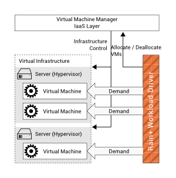

Rain+ workload driver
=====================

Rain+ was designed to generate realistic variable workload on an IaaS cloud testbed environment including dynamic allocation and deallocation of VMs during a benchmark. Rain+ extends the original Rain implementation found [here](https://github.com/yungsters/rain-workload-toolkit). It adds the following functionality: 

* Integration with [Sonar](https://github.com/jacksonicson/sonar) and [Times](https://github.com/jacksonicson/times). Time series of request response times and other systems statistics are stored in Sonar. Times serves as an archive for time series data describing variable workload on a target over time. 
* Thrift RPC interfaces to configure and trigger a Rain+ workload driver instances. This allows to synchronize multiple Rain+ instances. 
* Complete refactoring of the Scoreboard implementation to gather statistics. Percentiles on the operation duration are calculated by the [P-Square](https://github.com/jacksonicson/psquared) algorithm without storing samples. 

## Usage scenario

Rain+ is used to generate realistic workload on one or multiple server-side applications running in VMs. Load is generated by simulating multiple users that are running queries on the server-side application. To generate querys Rain+ uses a load driver implementation, that is typically required for each application. It implements the code to generate new queries, e.g. by using a Markov chain, and to execute the query on the server-side application. A load driver is used by many threads in parallel, each one simulating a single application user. The number of parallel simulated users gets varied over time to resemble realistic workload scenarios.

Rain+ supports dynamic targets, new VMs are allocated while existing ones are deallocated during an experiment. This allows Rain+ to drive realistic workload against an IaaS cloud infrastructure test bed. As shown by the following figure a schedule describes when a new VM gets allocated and how long it lives. 

